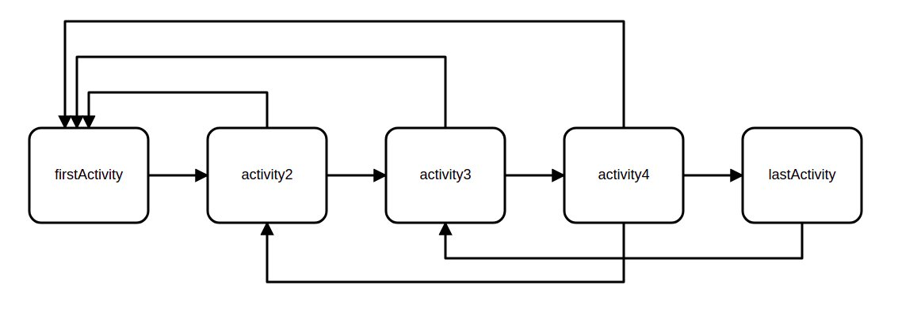

<h2 align="center">PHP Engine For Simple Business Workflows</h3>

<p align="center"> This is an amazing workflow engine to interact with your simple business workflows.</p>
<p align="center">This core build your business workflow model using simple activity array of configuration. Code client can run different actions on built process model and update model status.</p>


<!-- TABLE OF CONTENTS -->
<details open="open">
  <summary>Table of Contents</summary>
  <ol>
    <li><a href="#Installation">Installation</a></li>
    <li><a href="#Workflow Main Concepts">Process Main Concepts</a></li>
    <li><a href="#Usage">Usage</a></li>
    <li><a href="#contributing">Contributing</a></li>
    <li><a href="#Licence">Licence</a></li>
    <li><a href="#contact">Contact</a></li>
    <li><a href="#todo">Todo List</a></li>
    <li><a href="#Suggested Features">Suggested Feature</a></li>
  </ol>
</details>

# Installation

Simply run composer require command to include this library in your project
```shell script
    composer require mehrdadmahdian/php-workflow-core
```

to access to library feature, this namespace should be used: `Escherchia\ProcessEngineCore`

# Process Main Concepts

It is assumed that process is made up of multiple activity blocks.

- Each activity has its own unique name. This is the key to reach activity element.
- Each activity could be connected to multiple sources. Sources must be in type of activity.
  - An activity could have no source. It means on start action, this activity's status will be updated to `active` status   
- Each activity could be connected to multiple targets. Targets must be in type of activity.
  - An activity could have no target. It means process is in last activity state.
- Each activity has its current status. statuses may be between one of these statuses: `active`, `inactive`, `done`.
- At the start of process all activities have `inactive` status.
- When activity target is triggered, the target activity goes to `active` status. 
- Each activity could have its own observers. while updating activity status, observer will be notified. 
- This engine does not support conditional or parallel flows.

An example of process is something like this figure:


<!-- USAGE EXAMPLES -->
# Usage

An example of process configuration array is introduced here. This is a process with 3 activities which is not started yet and all activities has null or inactive status. 

Code Client decided where to load configuration. it can be loaded from permanent storage, or it could be loaded statically form a file. 
```php
    $configuration = [
       'activities' => [
           [
               'name' => 'act1',
               'sources' => [],
               'targets' => ['act2'],
//               'status'  => ElementInterface::STATUS_INACTIVE,
               'observers' => [ActivitySampleObserver::class],
               'extra-actions' => [
                    SomeActionTypeWhichImplementsActionInterface1::class,
                    SomeActionTypeWhichImplementsActionInterface2::class
                ]           
           ],
           [
               'name' => 'act2',
               'sources' => ['act1'],
               'targets' => ['act3'],
//               'status'  => ElementInterface::STATUS_INACTIVE
           ],
           [
               'name' => 'act3',
               'sources' => ['act2'],
               'targets' => [],
//               'status'  => ElementInterface::STATUS_INACTIVE
           ],
       ]
    ];
```

Process model could be built using package built-in facade method.

```php
    use Escherchia\ProcessEngineCore\ProcessEngineCoreFacade;
    $model = ProcessEngineCoreFacade::buildProcessModel($configuration);
```

## Actions
client could run engine action using built-in facade too:

```php
    use Escherchia\ProcessEngineCore\ProcessEngineCoreFacade;
    $model = ProcessEngineCoreFacade::runEngineAction($model, $action, $params);
```
after each action type, updated model is accessible. Updated model data must be persisted by library client if it is needed.

Two built-in actions are supported in this library and each one has its own params.
### Start Action
No Parameter is needed in this type of action
```php
    use Escherchia\ProcessEngineCore\ProcessEngineCoreFacade;
    $model = ProcessEngineCoreFacade::runEngineAction(
        $model, //suppose that model is defined previously in the code. mdoel is in type of ModelInterface 
        'start'
    );
```

### Transition Action
```php
    use Escherchia\ProcessEngineCore\ProcessEngineCoreFacade;
    $model = ProcessEngineCoreFacade::runEngineAction(
        $model,
        'transition',
        ['current_activity_key' => 'act1', 'target_activity_key' => 'act2']
     );
```

### Extra Actions
Inside of built in actions of workflow core, we can run desired action which is implements `ActionInterface`.
To do that, action class must be fed to `runEngineAction` like this:
```php
    use Escherchia\ProcessEngineCore\ProcessEngineCoreFacade;
    $parameters = [
        //key: //value,
        //key2: //value2,
        ...
    ];         
    $model = ProcessEngineCoreFacade::runEngineAction(
        $model,
        \Path\To\My\Custom\Action::class,
        $parameters
     );
```

## Observers
No description yet.

<!-- CONTRIBUTING -->
# Contributing

if you want to contribute in this project please follow this instruction.

1. Fork the Project
2. Create your Feature Branch (`git checkout -b feature/AmazingFeature`)
3. Commit your Changes (`git commit -m 'Add some AmazingFeature'`)
4. Push to the Branch (`git push origin feature/AmazingFeature`)
5. Open a PR on this repository
6. Wait to accept and merge the PR

<!-- LICENSE -->
# License

Distributed under the MIT License.

<!-- CONTACT -->
# Contact

Mehrdad Mahdian: [Gmail](escherchia88@gmail.com)

Project Link: [PHP Workflow Core](https://github.com/escherchia/process-engine-core)


# Todo
- missing tests
- custom action support
- get available actions from activity
- support published configurations file. 
- configuration validator
- action validator implementation

# Suggested Features to contribute
- wrapper for laravel and other php frameworks
